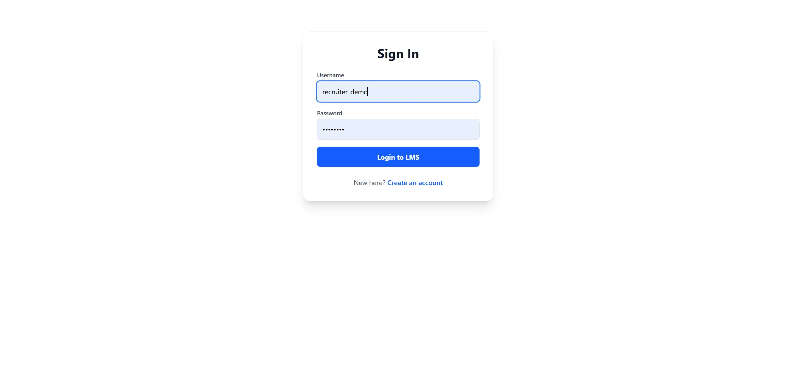
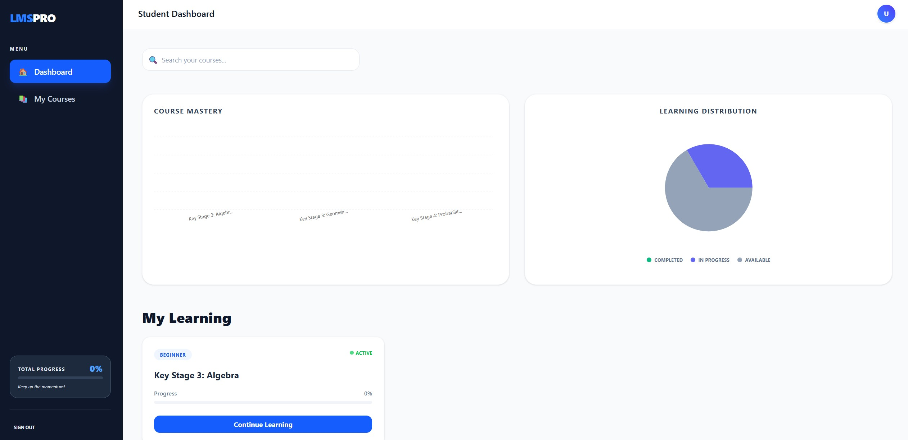
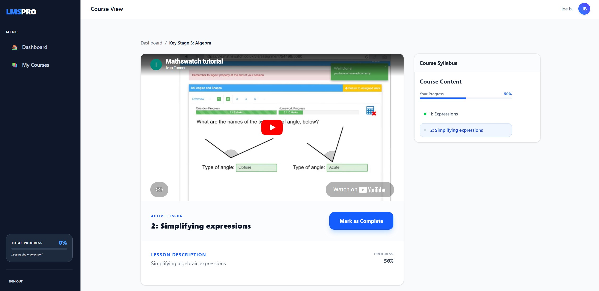
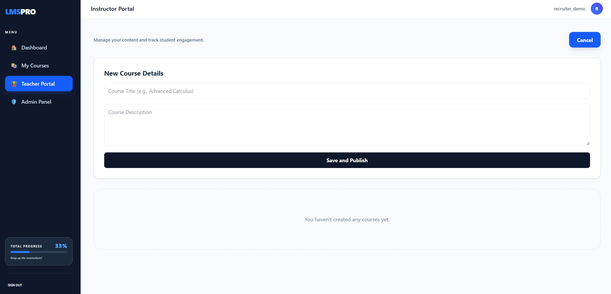
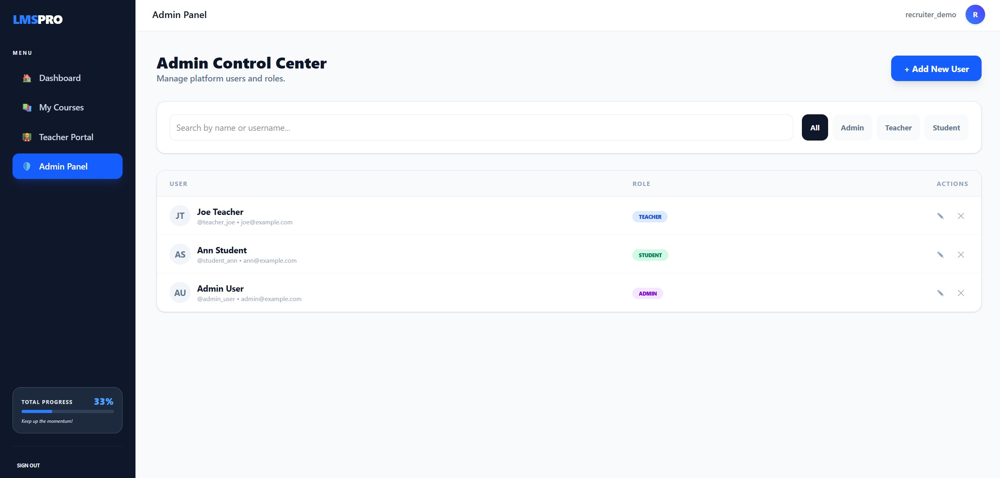
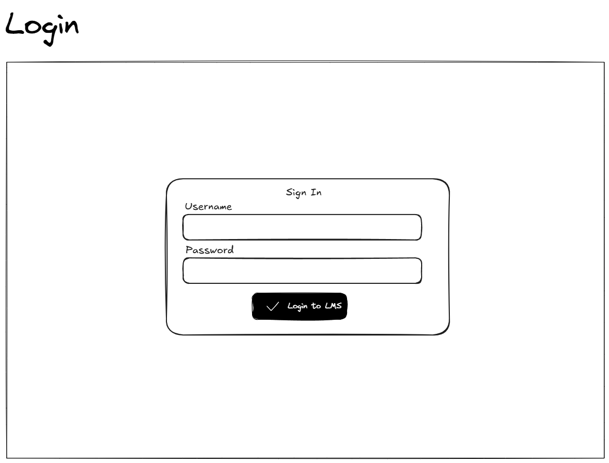

# LMS PRO - Professional Learning Management System

**[Live Demo](https://education-management-platform-frontend-production-88fa.up.railway.app/)**

[](#)
[](#)

A sophisticated, full-stack educational platform demonstrating advanced software engineering skills. This Learning Management System showcases expertise in React/Django development, JWT authentication, role-based access control, and modern UI/UX design principles.

## **Demo Credentials**

| Role        | Username       | Password       | Key Features                                   |
| :---------- | :------------- | :------------- | :--------------------------------------------- |
| **Teacher** | `demo_teacher` | `P@ssw0rd123!` | Course creation, Analytics, Content management |
| **Student** | `demo_student` | `P@ssw0rd456!` | Enrollment, Progress tracking, Flashcards      |

> **Note:** For security, administrative access is restricted. To request a full administrative walkthrough, please contact the developer.

---

## **User Interface Preview**

### **Secure Authentication**


_Secure JWT-based authentication with role detection_

### **Student Dashboard**


_Personalized learning path and course discovery._

### **Progress & Analytics**


_Real-time tracking of lesson completion and educational milestones._

### **Teacher Portal**


_Teacher interface for dynamic course and lesson architecture._

### **Admin Panel**


_User management and system administration_

---

## **Wireframes & UX Planning**

Before implementation, the platform's user journey and layout were meticulously planned using **Excalidraw**. This ensured a content-first approach and a modular UI architecture.

### **Login & Identity**



### **Student Dashboard**


### **Instructor Content Creation**


### **Course & Lesson View**


---

## **Core Functionality & Role-Based Access**

### **For Students**

- **Browse Catalog**: Discover and enroll in available math courses.
- **My Learning**: Access a personalized dashboard of enrolled courses.
- **Progress Tracking**: Real-time tracking of lesson completion.
- **Certification**: Generate completion certificates upon finishing a course.

### **For Teachers**

- **Instructor Portal**: Create and manage course content and lessons.
- **Analytics Dashboard**: Monitor student enrollment and overall progress.
- **Content Management**: Dynamic tools for lesson architecture and sequencing.

### **For Administrators**

- **User Management**: Oversight of user accounts and role assignments.
- **System Control**: Full management of courses and platform configurations.

---

## **Technology Stack & Dependencies**

### **Frontend: React Ecosystem**

- **[React 19](https://react.dev/):** UI library for building modular, functional components.
- **[Vite 7](https://vitejs.dev/):** High-performance frontend build tool.
- **[Tailwind CSS 4](https://tailwindcss.com/):** Utility-first CSS framework for professional styling.
- **[Axios](https://axios-http.com/):** Promise-based HTTP client for API communication.
- **[React Router 7](https://reactrouter.com/):** Declarative routing for SPA navigation.
- **[Recharts](https://recharts.org/):** Composable charting library for analytics.
- **[Lucide React](https://lucide.dev/):** Professional icon set.

### **Backend: Django REST Framework**

- **[Django 6](https://www.djangoproject.com/):** High-level Python web framework.
- **[Django REST Framework](https://www.django-rest-framework.org/):** Toolkit for building Web APIs.
- **[SimpleJWT](https://django-rest-framework-simplejwt.readthedocs.io/):** JWT authentication for secure sessions.
- **[WhiteNoise](http://whitenoise.evans.io/):** Efficient static file serving for production.
- **[Psycopg2](https://www.psycopg.org/):** PostgreSQL adapter for Python.

### **Infrastructure & Deployment**

- **[Railway](https://railway.app/):** Cloud platform for infrastructure management.
- **[PostgreSQL](https://www.postgresql.org/):** Advanced relational database.

---

## **Technical Architecture**

### **System Workflow**

1. **Authentication**: Users authenticate via the React frontend. The backend validates credentials and issues a **JWT (JSON Web Token)**.
2. **API Requests**: The frontend stores the token and includes it in the `Authorization` header for all subsequent API calls using **Axios Interceptors**.
3. **Role-Based Logic**: The Django backend checks the user's `Profile` role before granting access to specific endpoints or data.
4. **State Management**: React's `useEffect` and `useState` hooks keep the local UI in sync with the database.

---

## **Local Setup & Installation**

### **Prerequisites**

- Python 3.13+
- Node.js 20+
- Git

### **Backend Setup**

1. Navigate to the backend directory: `cd backend`
2. Create and activate a virtual environment:
   - Windows: `python -m venv venv` then `venv\Scripts\activate`
   - Mac/Linux: `python -m venv venv` then `source venv/bin/activate`
3. Install dependencies: `pip install -r requirements.txt`
4. Initialize database: `python manage.py migrate`
5. Import demo data: `python manage.py loaddata all_data_complete.json`
6. Run server: `python manage.py runserver`

### **Frontend Setup**

1. Navigate to the frontend directory: `cd frontend`
2. Install dependencies: `npm install`
3. Run development server: `npm run dev`
4. Access the app at: `http://localhost:5173`

---

## **Running Tests**

### **Backend (Django)**

Run integration and API tests:

```bash
cd backend
python manage.py test
```

### **Frontend (Vitest)**

Run component and unit tests:

```bash
cd frontend
npm test
```

---

## **Performance & Quality**

- **Lighthouse Scores**:
  - **Best Practices**: 100/100
  - **Accessibility**: 93/100
  - **SEO**: 91/100
- **Automated Testing**: 22/22 Passing (Validated RBAC, API handshakes, and data consistency).
- **Optimizations**: Implemented lazy loading for code splitting and response caching.

---

## **Project Structure**

```
Project_2_LMS/
├── backend/                 # Django REST API
│   ├── api/                # API endpoints and serializers
│   ├── core/               # Django settings and URLs
│   └── manage.py           # Django management commands
├── frontend/               # React.js SPA
│   ├── src/
│   │   ├── components/     # Reusable UI components
│   │   ├── pages/         # Route-based page components
│   │   └── api.js         # Axios configuration
└── docs/                  # Documentation & Planning
    ├── screenshots/       # UI Implementation Captures
    └── wireframes/        # UX/UI Planning (Excalidraw)
```

---

## **Technical Challenges Solved**

1. **JWT Token Management**: Implemented secure token refresh mechanism.
2. **Role-based UI Rendering**: Dynamic component display based on user permissions.
3. **Database Schema**: Optimized relational model for educational data.
4. **API Security**: Hardened CORS and CSRF configurations for cross-domain production environments.

---

## **About the Developer**

After a decade-long career in mathematics, I transitioned into software engineering to apply my expertise in logic and system architecture to building high-performance web applications. I specialize in the React/Django ecosystem with a focus on Test-Driven Development (TDD).

**Contact**: Connect through professional platforms for collaboration opportunities.
